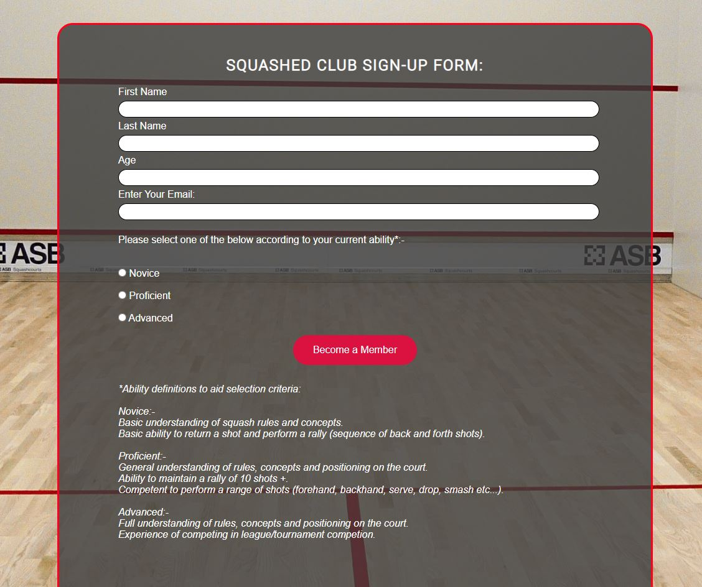

# Squashed

Squashed is a website for an Aberdeen City based squash club, with a further catchment area of the surrounding Aberdeenshire region.

Squashed is aimed at squash players of all abilities and experience with the only stipulation being that they are above the age of 6 years old.

Squashed squash club plays out of the Aberdeen Sports Village (ASV) Sports Center. ASV houses 4 commonwealth standard squash courts and a viewing gallery for spectators.

Squashed intends to bring fellow squash enthusiasts together, promoting healthy competition, an active lifestyle and helping showcase the many enticing aspects of the sport.

## Features
- Navigation Bar
  - Featured on all four pages, the fully responsive navigation bar includes links to the Home page, Basic Rules of Squash, Gallery and Sign-up page. The navigation bar looks identical and its location (within the header) remains consistent on each page to allow for easy navigation across all devices.
  - The Navigation Bar is designed to have a solid red underscore below the current page. This allows the user to see at a glance which page of the site is currently being viewed. The underscore was designed to display solid red for symbology purposes in order to replicate the markings on a squash court.

- The Home page
  - The home page starts with a large image to identify the subject of the webpage. The image has been setup with a zoom function to grab attention and add style. The image was specifically chosen as it displays the same colours that are prevailant throughout the website.
   - Text overlay on the image states the purpose of the club and advises all welcome to aid inclusivity.

- Club Information Section
  - This section gives overall detail of the club, including history (when it was founded and by who), facility details, information on club teams and future club asperations (to win a trophy). The text area providing the previously stated information is situated to the left of this section and takes up about two thirds of the width of the page. A stock image of a squash racket and ball was added to the right side of the text to provide balance. The image matches the primary colours used on the page and blends with the white background so no border is required. This image is programmed to disappear when viewed on any device with a screen size below 1200 pixels.

- Club Details Section
  - Further details are provided in this section relating to the sports village which is the home venue of the squash club where its matches are to be played. This area is broken down into three sections, horizontally situated when viewed on a device above 1200 pixels and vertically stacked when viewed on any device under 1200px. Details of the three sections are as follows:-
    - Club Address section: This section contains the address of the Sports Center including contact details and a link to the website. Icons relating to location (in this case pins, commonly used as markers on a map) were selected and positioned on either side of the heading. An image of the facilitys logo is provided with a white background and no border so it blends into the white background seemlessly.
    - Court Price section: This section contains details of the cost of hiring a squash court at Aberdeen Sports Village. Icons relating to price (in this case uneven stacks of coins) were selected and positioned on either side of the heading. Below the heading is text stating the time allocated for the hire which is 45 minutes (the standard time for a squash match). Also detailed are 2 sets of prices for peak times and off-peak times. Peak times are when the sports center is at its busiest, as such this is the more expensive court hire price. Off-peak times are when the sports center is quieter, these hours are more anti-social, as such the court hire is cheaper than at peak times. Of the 3 sections contained within Club Details, this section contained the least amount of text. As such an image was added to visually aid this section and provide balance to the page. A stock image of a squash ball with a white background was selected for this purpose. It provides a clean, squash related image that matches well with the selected colour scheme of the website. No image border was added as the white image background blends with the white colouring of this area.
    - Opening Hours section: This section contains the ASV opening and closing times. Icons relating to time (in this case clock faces) were selected and positioned on either side of the heading. Each day of the week is listed vertically with the facilitys opening and closing times detailed next to each day. Below this is further details as to which hours of the day are classed as peak or off-peak times; this relates to the cost of hiring a squash court as per the court price section above.

- Home Page Bottom Section
    - The Bottom Section consists of two sections which are horizontally positioned when viewed on screen sizes of 1200 pixels and above. When viewed on screen sizes of below 1200px the two sections become vertically stacked. Details of the two sections are as follows:-
      - A large image of the Aberdeen Sports Village is positioned on the left of this section (then at the top when viewed below 1200px). This image displays the ASV on a clear summers day. This image was chosen as I felt it shows the facility looking clean and inviting. I felt it was important to have a large image showcasing the sports center due to it being an integral part of the club and also to aid locating the venue for new club members.
      - A large google map showing the location of the Aberdeen Sports Village (centered on the map and identified with a pointer) is positioned on the right of this section (then beneath when viewed below 1200px). The map contains the ASV address, a star rating of the facility and a pointer showing exact location. This map is interactive within the webpage, you can zoom in and out or move around the map at will.
      - The two sections together (image of ASV and map showing location) provide all the details required to find the venue with ease.

- The Footer
  - The footer section includes links to the relevant social media sites for Squashed. The links will open to a new tab to allow easy navigation for the user and ease of return to the original site.
  - The footer is valuable to the user as it encourages them to keep connected via social media and receive regular updates from the club which in turn promotes the feeling of inclusion within the club.

- Basic Rules of Squash
  - This page outlines the basic rules of the game of squash. A full screen image of an exhausted squash player lying on a court was used as a background for this page. The image was selected as it is relevant to the subject of the webpage and had the desired layout required for the background to this page. The image layout has the main image body (the squash player) only taking up approximately one third of the right side of the image, leaving a large clear section on the left side showing only empty squash court. This clear area was used as background for overlaying the text detailing the rules. A single icon showing a checklist was selected and positioned next to the page heading for aesthetic purposes. The image was fixed so that it would remain in place whilst scrolling down through the rules, this was acheived by setting the background-attachment to fixed. This page is valuable in that it states the rules of the sport, these rules can be used by beginners still learning the sport or by more experianced club members as a reference point to resolve any match related disagreements.
  - the background image to this page was modified using Microsoft Paint. The court markings to the left of the image were edited as I didnt like the effect of having this line running through the section of text.
  

- Gallery
  - The gallery provides the user with club/sport related images displaying squash matches, squash team meetings, squash lessons and medal winners from competition/events.
  - The gallery page is structered to show images displayed using the masonry design style. Images are displayed across four columns when viewed on screen sizes above 950 pixels. Screen sizes of 950px down to 801px will display across 3 columns. The gallery display will reduce to two columns when viewed on any device with a screen size of 800px and below. Thus ensuring gallery images are viewed with ease across all devices.
  - This section is valuable as it again promotes the feeling of inclusion within the club through displaying images of the squash team members together celebrating success and enjoying the sport.

- Sign-up
  - The sign-up page allows the user to sign-up to squashed and register as a member of the club. This page requires name, age and email details entered. A further requirement is that a selection be made on the users ability via a radio button configuration. This selection criteria is included to allow the club to match players of similar competence to ensure competative matches. Another aspect of the user ability request is for the identification of more experianced members with the aim of creating a future mentoring programme for novice members to guide and encourage them on their participation in the sport. All details previously listed require to be inputted before the form can be submitted, failure to do so will bring up an error message that will direct the user to the section of the form that requires completed.
  - The sign-up page is designed with a full screen image covering the entire body of the page. The image chosen is of an empty squash court. This image was chosen as it correlates with the topic of the website, the image colour scheme ties in with the colour theme of the site (clean - white, black and red) and it also acts as a border to the main element of the page which is the sign-up form itself.
  - The sign-up form is horizontally centered on the page with padding added to create a gap below the header for aesthetic purposes. The opacity of the form was set to allow the image behind to be visable but also to ensure the form retains the look of a form. A solid red border has been added around the form to aid differenciation with the background image. A thick red border was chosen as it is designed to resemble the markings on a squash court. The border edges of the form were rounded to contrast with the sharp edges of the background image.
  - The sign-up form submit button has been designed to display the text "Become a Member" and is coloured red with white writing to standout from the page so that it is easily identified by the user. The button had been designed with a rounded appearance in keeping with the look of the form itself. When hovered over, the submit button changes colour to white and writing colour to red. This makes it more obvious to the user that the button is to be selected for information submission. The colours chosen also remain consistent with the colour scheme of the website.
  - Beneath the submit button there is a text area providing a definition for each range of ability (novice, proficient, advanced) to aid the selection of the appropriate current ability via the radio button selection. This is provided to assist the user and to align the users thought process for selection, i.e. some may think they are advanced when in fact they are actually proficient according to the definitions provided.
  - The background-colour of this page has been set to black so that should the image fail to load then the white writing on the sign-up form will still be visible.

- Features Left to Implement
  - A page or section dedicated to the mentoring of novice club members by more experianced members. This page would contain videos aimed at improving players technical abilities and positioning on the court. There would be a tips section where members can add advice they have found beneficial to improving their own game. This page would also contain a section for arranging one on one training/practice sessions with any seasoned club members wishing to pass on their experiance/knowledge to the next generation of squash players.

## UX/UI Section

### Site Goals
The goal of Squashed is to bring together squash players of all abilitys from the Aberdeen City and Aberdeenshire area to join a club for fellow squash enthusiasts. The club website provides the following details:-
- Club history: when and by who the club was founded.
- Details of the facility where the club plays its matches including location, opening times, closing times and cost of court hire.
- Rules of the sport of squash.
- Gallery images of squashed club members.
- Membership sign-up where current squash ability details are required in order to group players with the aim of 

### Design Choices

### User Stories

### Wireframes

- The wireframes for this project were created using hand drawn sketches. As the project developed it remained largely consistant to the wireframe plan with only minor changes occuring. Details of said changes are elaborated on below each wireframe:-

### Home Page Wireframe

- Justification of the title changed from centered to left justified, this was purely preferential for the look of the site. The navigation bar was to be centre justified below the title however this was moved to the right side of the header and inline with the title. Again this was preferential as i felt it gave a more balanced look to the header. All divisions within the body of the homepage were to be seperated with thick (2px), solid, red lines. This was designed to look like the markings on a squash court. Once added I didnt like the blocky look this created and decided to remove most of the border seperation lines to give a cleaner look to the site.

### Basic Rules of Squash Wireframe

- The Basic Rules of Squash page was envisaged in the wireframe to be a text overlay on a background of a squash related image. The image selected (post wireframe creation) was a picture with the main detail shown on only one side leaving an empty area on the left to be utilised for text.

### Gallery Wireframe

- The Gallery page wireframe was detailed showing only the body of the page. Different image sizes and styles were experimented with during the creation of this page. The masonry style of gallery was settled on with four columns of images being shown on the largest screen size. This is gradually reduced to columns of two images for the smallest device screen size which would be as displayed on a mobile phone screen.

### Sign-Up Page Wireframe

- The Sign-up page was envisaged in the wireframe to be a text overlay on a background of a squash related image. The image selected (post wireframe creation) was a picture of an empty squash court. This was used to border the sign-up form, the form itself was given a grey background with its opacity set to enable it to be partially see through. This resulted in a sleek professional look to the page. Rounded edges were added to the form to contast the sharp edges of the court as displayed in the background image.

## Design

  - Colour Scheme
   - The colours used were red, black and white. The reason being these are the standard colours of the markings on a squash court. White for the walls of the court, red for the service and boundry lines and black for the front wall, bottom boundry line (also known as the tin).

  - Typography
   - The Roboto font was used for title & headings and the PT Serif font was used for the body of the website. The backup style is Sans-serif should the selected fonts fail to load correctly. I felt both these fonts complemented each other well whilst being easily readable and having a modern look.

  - Images
   - The hero image is a bright and clean image making the website easily identifiable with the sport of Squash. The colours of the hero image are the same colours as used throughout the website - which are the same colours as would be found on a squash court.
   - The Aberdeen Sports Village Image is incorporated to aid new club members finding the venue where the squash clubs matches will be played. The image was chosen as it shows the sports center looking clean and inviting which aims to heighten the appeal of joining the club.
   - Home Page stock image of a squash ball was chosen to fill space and bring balance to the page. The image was chosen as it is relevant to the sport of squash, the colour schemes match the site and the white background of the image blends with the websites white background to create a clean effect.
   - The Home Page stock image of an illustration of a squash racket was chosen to fill space and bring balance to the page. The image was chosen as it is relevant to the sport of squash, the colour schemes match the site and the white background of the image blends with the websites white background to create a clean effect.
   - The Basic Rules of Squash image is a background image that fills the entire body section of the page. The image is of an exhausted squash player lying on a court. The image was selected as it is relevant to the subject of the webpage and had the desired layout required; whereby the main image body (the squash player) is situated to one side of the image. This leaves a large clear area showing only empty squash court which was used for overlaying the text detailing the rules of the sport. The image was doctored using Paint 3D to remove some of the court markings that entered the text section area and obscured the text.
   - The Sign-up page image is a background image that fills the entire body section of the page. The image chosen is of an empty squash court. This image was chosen as it correlates with the topic of the website, the image colour scheme ties in with the colour theme of the site (squash court marking colours - white, black and red) and it also acts as a border to the main element of the page which is the sign-up form itself.

  - Icons
   - Icons were incorporated from Font Awesome for aesthetic and UX purposes. Icons were used for the following headings - Club Information, Club Address, Opening Hours, Court Price and Basic Rules of Squash.

## Testing

 - I tested that this page worked across the following browsers:
   - Chrome
   - Safari
   - Firefox
   - Microsoft Edge
 - I manually tested all pages of the website using the inspect tool. Each page was reduced/increased in size with modifcations made using media querys to ensure website structure remained responsive and that all text remained legible and clear.
 - The form section has been fully tested, see attached Manual Test sheet below for further details:-

 

### Bugs
- When deploying my project to Github it would only display in basic form of text with no styling or imagery. The reason being that my Stylesheet href was set as ../ when it should have been ./ - Removing the extra . meant the xxxxxxxxxxxxx

## Technologies Used
- HTML5
- CSS3

## Deployment & Local Deployment
### GitHub Pages
The project was deployed to GitHub Pages using the following steps:-
- Log in to GitHub and locate the GitHub Repository
- At the top of the Repository (not top of page), locate the "Settings" Button on the menu.
- Scroll down the Settings page until you locate the "GitHub Pages" Section.
- Under "Source", click the dropdown called "None" and select "Master Branch", the page will automatically refresh.
- Scroll back down through the page to locate the now published site link in the "GitHub Pages" section.

### Forking the GitHub Repository
By forking the GitHub Repository we make a copy of the original repository on our GitHub account to view and/or make changes without affecting the original repository by using the following steps:-
- Log in to GitHub and locate the GitHub Repository
- At the top of the Repository (not top of page) just above the "Settings" Button on the menu, locate the "Fork" Button.
- You should now have a copy of the original repository in your GitHub account.

### Making a Local Clone
- Log in to GitHub and locate the GitHub Repository
- Under the repository name, click "Clone or download".
- To clone the repository using HTTPS, under "Clone with HTTPS", copy the link.
- Open Git Bash
- Change the current working directory to the location where you want the cloned directory to be made.
- Type git clone, and then paste the URL you copied in Step 3.
- Press Enter. Your local clone will be created.

## Validator Testing
- HTML
  - xxx
- CSS
  - xxx

## Credits

### Content
- The Basic Rules of Squash text content was taken from http://www.squashsa.asn.au/w/participation/basic-guide-to-squash
- The icons used for the following headings: Club Information, Club Address, Opening Hours, Court Price and Basic Rules of Squash were taken from https://fontawesome.com
- The map section was sourced from https://www.google.com/maps
- Instructions on how to add a google map to my webpage was taken from https://blog.duda.co/responsive-google-maps-for-your-website
- The icons in the footer were taken from https://fontawesome.com

### Media
#### Home Page
- The following Home Page images were sourced from the following sites listed adjacent:-
  - The Hero Image on this page was sourced from the following site: https://integralspor.com/sports-facilities/squash-courts
  - The Club Information Image on this page was sourced from the following site: https://www.pinterest.co.uk/pin/squash-sport-icon-illustration-ad-ad-sportsquashillustrationicon--841117667891098365/
  - The Aberdeen Sports Village logo image on this page was sourced from the following site: https://www.sportaberdeen.co.uk/news/aberdeen-sports-village-supports-local-awards
  - The Court Price image on this page was sourced from the following site: https://www.shutterstock.com/search/squash-ball
  - The Aberdeen Sports Village facility image on this page was sourced from the following site: https://en.wikipedia.org/wiki/Aberdeen_Sports_Village

#### Basic Rules of Squash Page
- The background image on this page was sourced from the following site: https://www.freepik.com/free-photos-vectors/squash-player/8

#### Gallery
- The following Gallery images were sourced from the following sites listed adjacent:-
  - squash-photo-1, sourced from site: https://racquets-fitness-centre.com/tim-vail-training-at-racquets/
  - squash-photo-2, sourced from site: https://www.psclondon.com/squash
  - squash-photo-3, sourced from site: http://tenrandomfacts.com/squash-sport/
  - squash-photo-4, sourced from site: https://www.englandsquash.com/get-involved/play/ways-to-play/junior-squash
  - squash-photo-5, sourced from site: https://www.spencersquash.club/2018/10/22/monday-night-team-training-on-hold/
  - squash-photo-6, sourced from site: https://cambs-squash.uk/cambridgeshire-junior-squash/
  - squash-photo-7, sourced from site: https://juniorsquashcornwall.wordpress.com/2017/08/08/junior-training-on-tuesdays-at-truro-squash-and-racketball-club/
  - squash-photo-8, sourced from site: https://surreysquash.co.uk/events/
  - squash-photo-9, sourced from site: https://interactivesquash.com/squash-coaching/
  - squash-photo-10, sourced from site: https://www.scottishsquash.org/junior-champ-lucy-aims-to-bridge-gap-with-senior-pros/
  - squash-photo-11, sourced from site: https://surreysquash.co.uk/events/list/page/2/?tribe-bar-date=2022-06-08
  - squash-photo-12, sourced from site: https://squash.ua/en/news/nordic-junior-squash-open-2022-rezultaty
 
#### Sign Up Page
- The background image on this page was sourced from the following site: https://asbsquash.com/timeline/info/14/squash-floor-solid-hardwood-or-engineered/

